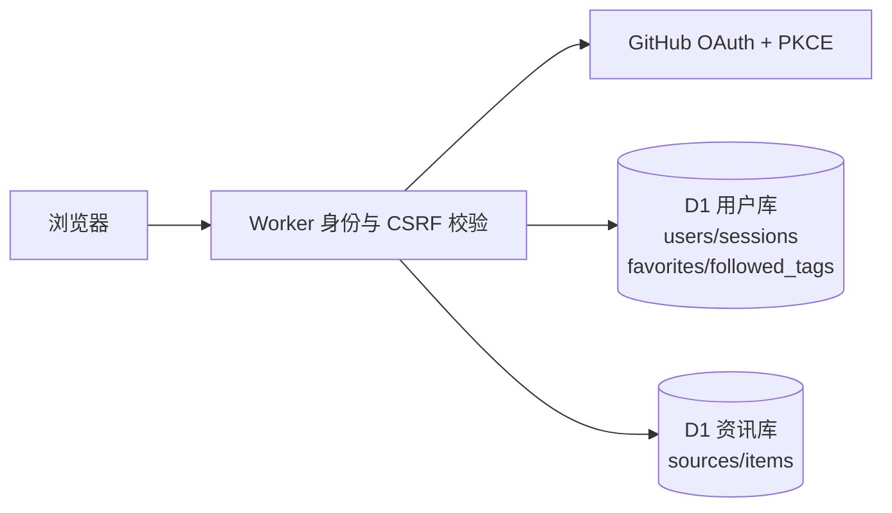

# 用户系统

## 交付边界

代码包含 GitHub 登录、退出、昵称修改、云端收藏、标签关注；2026-10-04 已配置 OAuth 密钥并完成真实 GitHub 登录验收。
GitHub Pages 仍是静态站，只提供本地收藏；云端功能通过 Cloudflare 同源站点使用，云端收藏与关注标签需要登录。

## 功能与限制

| 功能     | 约定                                                              |
| -------- | ----------------------------------------------------------------- |
| 登录     | GitHub 公共身份；不请求邮箱、仓库权限，不保存 GitHub access token |
| 会话     | 7 天，最多 8 个设备会话；退出立即撤销当前会话                     |
| 资料     | GitHub 数字 ID、用户名、自定义昵称；昵称最多 60 字符              |
| 收藏     | 登录后可用；每用户最多 200 个文章 ID，仅可新增当前快照中的文章    |
| 标签     | 登录后可用；最多 30 个，每个最多 40 字符，点击快速筛选            |
| 访客数据 | 云端版游客不保存收藏记录；本地收藏仅存在于 Pages 静态版浏览器     |
| 同步     | 写入后、刷新页面或打开账号面板读取，不是实时推送                  |
| 历史     | 不保存文章全文，快照外收藏不会出现在资讯列表                      |

## API

| 方法 | 路径                | 请求                                  |
| ---- | ------------------- | ------------------------------------- |
| GET  | /api/auth/session   | 查询登录状态、资料、收藏、标签和 CSRF |
| GET  | /api/auth/github    | 跳转 GitHub                           |
| GET  | /api/auth/callback  | OAuth 回调                            |
| POST | /api/auth/logout    | 退出当前会话                          |
| PUT  | /api/user/profile   | displayName                           |
| PUT  | /api/user/favorites | id、saved                             |
| PUT  | /api/user/tags      | tag、followed                         |

写操作使用同源 Cookie、Origin、X-CSRF-Token；JSON 请求上限 4KB。
个人响应禁止缓存，服务端从会话确定身份，不接受客户端指定账号。
Cookie 为 HttpOnly；HTTPS 下使用 Secure、__Host- 前缀、SameSite=Lax。
OAuth 使用签名 state、10 分钟有效期和 PKCE S256，固定回调地址。
数据库只保存会话令牌摘要；每会话每分钟最多 30 次成功资料/收藏/标签写入。
限流不是完整的抗攻击方案；未提供账号注销、自助数据导出、管理员面板或找回密码。
轮换 SESSION_SECRET 会使未完成 OAuth 流程失效，**不会撤销已有登录会话**。

## 免费边界

使用 Cloudflare 免费计划的 Workers 与 D1（SQLite）；没有付费数据库、模型 API 或邮件服务。
免费额度按账号共享，不承诺无限使用；超出额度可能不可用，不自动升级付费。
上线前在控制台核对 Workers、KV、Durable Objects 计划和用量。

## 配置与测试

- [本地与上线配置](setup.md)
- npm run check：格式、单元测试、类型与 Pages 构建。
- npm run test:backend：Python 后端 pytest（账号规则与采集管线）。
- npm run test:e2e：Pages 兼容性；先运行 npm run build。
- npm run test:accounts：Cloudflare 构建与模拟账号 API 浏览器测试。
- 浏览器测试通过不代表真实 GitHub OAuth 已验收。

参考：Cloudflare Durable Objects pricing / migrations / storage-api 官方文档，以及 GitHub Authorizing OAuth apps 官方文档。
