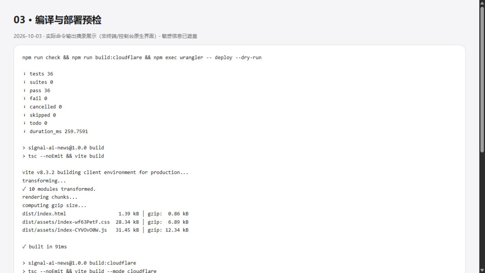
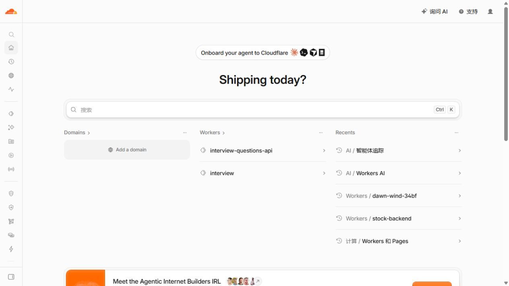
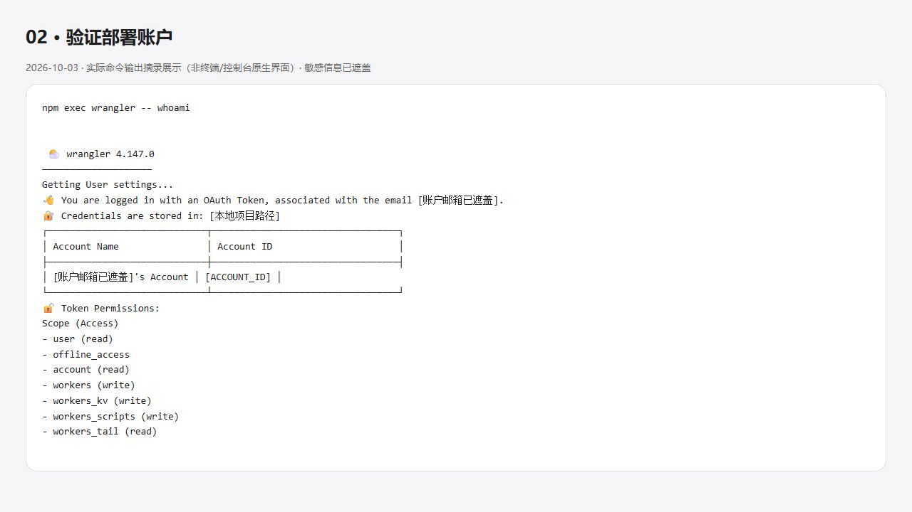
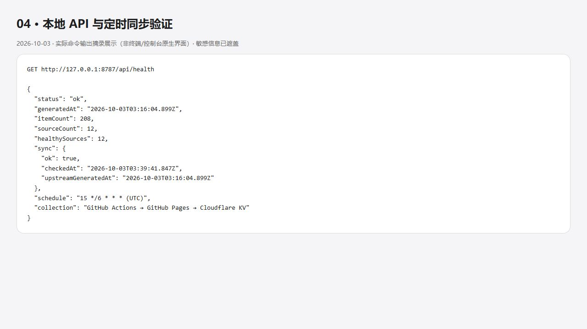
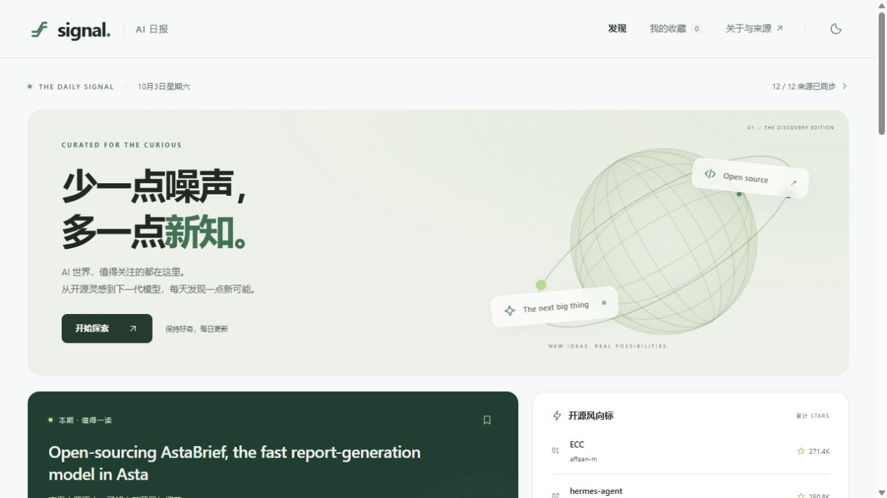
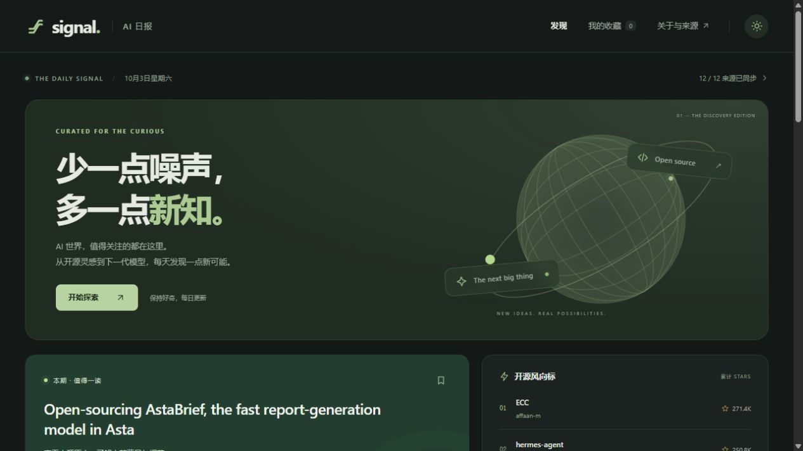

# 01 · 本地运行与 Cloudflare 授权

[返回目录](README.md) · 下一章：[部署](02-deploy.md)

## 1. 准备本项目

本次工作目录：C:/Users/wkl/Desktop/cc_work_space/AI-News。
使用 Node.js 24、npm、Git Bash；命令在项目根目录执行。
这些 Cloudflare 改动目前在本地，尚未推送；直接克隆旧版本不会拥有新脚本。

~~~bash
node --version
npm ci
npm run check
npm run build:cloudflare
~~~

check 包含格式检查、Node 测试、TypeScript 类型检查和普通前端构建。
Cloudflare 构建通过 .env.cloudflare 让前端请求 /api/feed。
本次 36 个 Node 测试通过；另完成 36 个浏览器用例。

## 2. 确认 Cloudflare 账号

在 Cloudflare 控制台登录自己的账号，进入 Workers 和 Pages。
本次沿用现有账号，不修改其他 Worker，不升级付费套餐。

## 3. 给本机 Wrangler 授权

本项目锁定 Wrangler 4.147.0，npm ci 已安装，不必全局安装。
若普通浏览器回调失效，使用本次成功的设备授权方式：

~~~bash
npm exec wrangler -- login --device --browser=false --scopes account:read user:read workers:write workers_kv:write workers_scripts:write workers_tail:read
~~~

1. 终端显示验证地址和一次性设备码。
2. 自己打开地址并输入当次设备码；核对账号与权限后同意授权。
3. 等待终端提示 Successfully logged in，再执行账号检查。

~~~bash
npm exec wrangler -- whoami
~~~

不要复用文档中的旧设备码，不要把 OAuth callback URL、令牌或本机授权文件提交到 Git。
本次授权同意页未留截图，下图保留的是成功后的账号检查输出（已脱敏）。

## 4. 启动本地完整前后端

已有本次 wrangler.json 可以直接使用；新账号需先按下一章配置 account_id 和 NEWS 绑定。

~~~bash
npm run build:cloudflare
npm exec wrangler -- dev --test-scheduled
~~~

浏览器打开 http://127.0.0.1:8787/。
本地 KV 与云端 KV 相互隔离，首次本地启动需要触发一次同步。
另开一个终端执行：

~~~bash
curl "http://127.0.0.1:8787/__scheduled?cron=15+*%2F6+*+*+*"
curl http://127.0.0.1:8787/api/health
~~~

定时事件异步执行，第一次可能仍返回 503；等待同步完成后再次检查 health。
本次得到 status=ok、itemCount=208、healthySources=12。
此调试入口仅用于本地，不是生产环境的公开同步接口。

## 5. 检查前端效果

刷新页面，测试搜索、标签、国内动态筛选、分类及主题切换。

注意：普通 build 和 build:cloudflare 共用 dist，后一次构建覆盖前一次。
普通 Vite preview 不能提供 Worker API；Cloudflare 模式请用 8787，不是原来的 4173。
