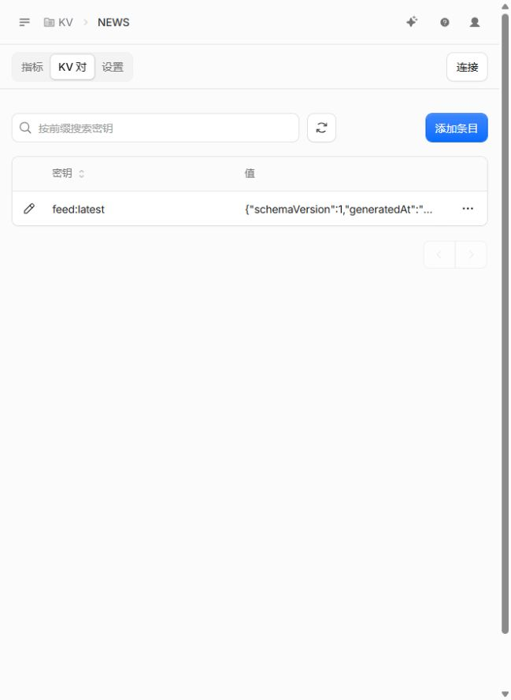
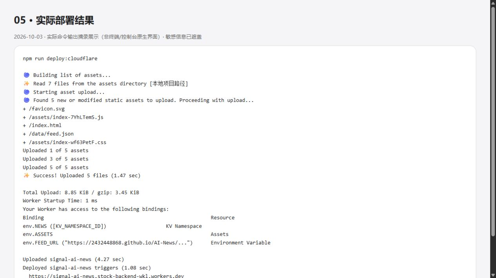
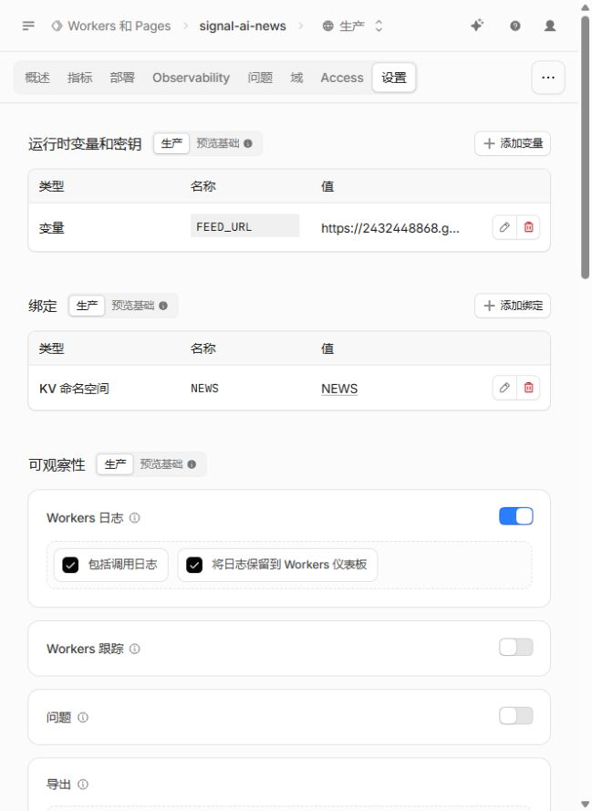
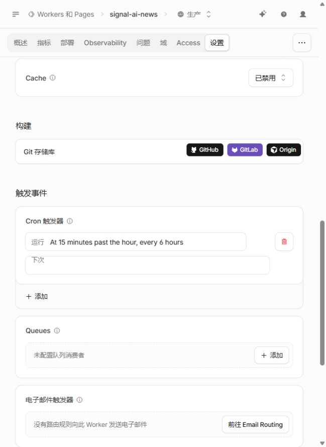
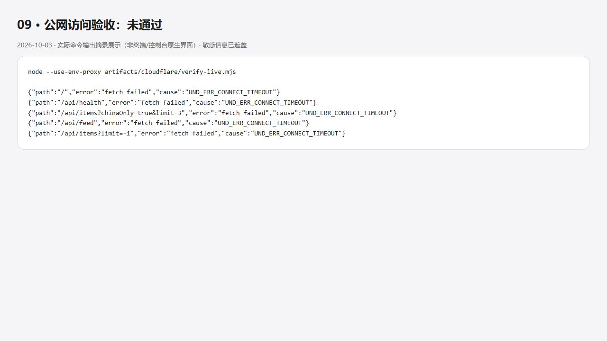

# 02 · KV 初始化与正式发布

[返回目录](README.md) · 上一章：[本地与授权](01-local-and-auth.md)

> 本实例已创建 NEWS 和 signal-ai-news。维护现有项目时跳过创建资源步骤，不要重复创建命名空间。

## 1. 仅首次创建 KV

~~~bash
npm exec wrangler -- kv namespace create NEWS
~~~

保存命令返回的 namespace id，在 wrangler.json 的 kv_namespaces 中填入。
account_id 从自己的账号获取，不要把本实例账号复制到其他人的项目。
绑定名必须是 NEWS，与 worker/index.mjs 一致。

本次配置结构如下；这是模板，尖括号内容需要替换，不能直接部署：

~~~json
{
  "name": "signal-ai-news",
  "main": "worker/index.mjs",
  "compatibility_date": "2026-10-03",
  "account_id": "<自己的 account id>",
  "workers_dev": true,
  "assets": {
    "directory": "./dist",
    "binding": "ASSETS",
    "run_worker_first": ["/api/*"]
  },
  "kv_namespaces": [{ "binding": "NEWS", "id": "<namespace id>" }],
  "vars": {
    "FEED_URL": "https://2432448868.github.io/AI-News/data/feed.json"
  },
  "triggers": { "crons": ["15 */6 * * *"] },
  "observability": { "enabled": true }
}
~~~

本地文件已写入本账号的真实配置。账号 ID、namespace ID 是资源标识，不是 API 密钥。
只把 FEED_URL 指向自己可信且经过完整校验的快照；Worker 边缘端只做体积及基本结构校验。

## 2. 初始化云端数据

~~~bash
npm run seed:cloudflare
~~~

脚本获取配置中的 GitHub Pages 快照并完整校验，将 feed:latest 写入远程 NEWS。
本次初始化 208 条资讯，12 个来源；可以在控制台 KV → NEWS → KV 对中确认。

**该命令会写入远程 KV，只用于首次初始化或有意恢复。**
不要当作日常更新命令反复执行；它不比较远程新旧版本，可能覆盖更新的数据。
日常 Cron 则比较 generatedAt，只保存更新快照。

## 3. 构建并发布

~~~bash
npm run build:cloudflare
npm exec wrangler -- deploy --dry-run
npm run deploy:cloudflare
npm exec wrangler -- deployments list
~~~

deploy:cloudflare 会再次构建，然后上传前端 dist 和 Worker 代码，同时应用配置中的 KV 绑定及 Cron。
本次部署版本：80905e64-6c9e-49b9-b5eb-d691db0829dc。
发布时间：2026-10-03 03:40:59 UTC（北京时间 11:40:59）。

## 4. 控制台确认发布

进入 Workers 和 Pages → signal-ai-news → 概述，确认版本及 workers.dev 域名。
CLI 发布完成与公网可以访问是两个不同的验收项。

## 5. 核对绑定与自动更新

进入该 Worker 的设置，确认 FEED_URL 变量、NEWS KV 绑定。
这些配置由 wrangler.json 管理，不需要在网页重复创建。

查看触发事件，确认 Cron 为 15 */6 * * *，即每 6 小时的第 15 分钟。

## 6. 公网验收（本次尚未通过）

浏览器访问 https://signal-ai-news.stock-backend-wkl.workers.dev。
命令行检查接口：

~~~bash
curl --connect-timeout 15 --max-time 30 https://signal-ai-news.stock-backend-wkl.workers.dev/api/health
~~~

本次网络访问 workers.dev 超时，远程预览也未取得有效响应。
不能用本地成功截图代替公网验收，不能据此宣称域名可用。
请在可访问该域名的网络重试；如果仍不通，再检查域名、部署和 Worker 日志。
绑定已有自定义域名可作为后续方案，本次未购买域名或修改 DNS。

下一章：[日常运维与验收](03-operations.md)
