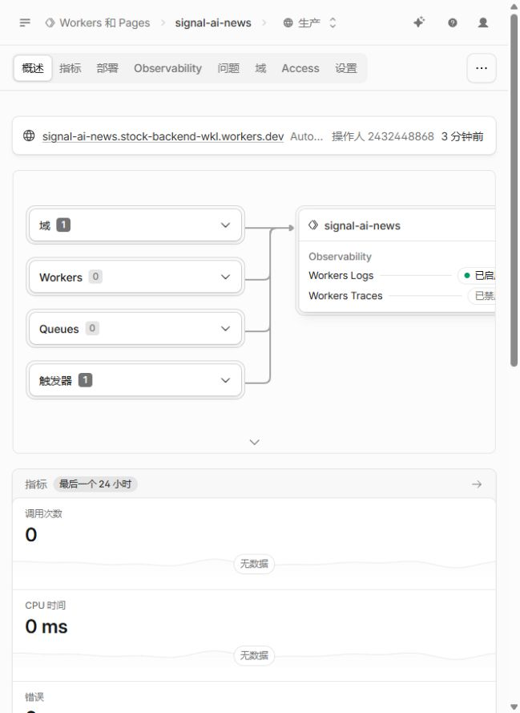

# AI News：Cloudflare 部署实战

> 实战日期：2026-10-03。Cloudflare 是云平台；“本地部署”指在电脑上模拟 Worker，发布后才运行在 Cloudflare 云端。

## 当前交付状态

| 项目 | 结果 |
|---|---|
| Worker + 静态前端发布 | Cloudflare CLI 和控制台均确认成功 |
| 项目名 | signal-ai-news |
| 发布版本 | 80905e64-6c9e-49b9-b5eb-d691db0829dc |
| 本地接口与页面 | 208 条资讯，12/12 来源正常；深浅主题验证通过 |
| 自动化验收 | 36 个 Node 测试、36 个浏览器用例通过 |
| 公网访问 | 当前网络连接 workers.dev 超时，尚未通过公网验收 |
| 云端定时执行 | 触发器已配置；首次自然执行尚未观察 |
| 记录范围 | 下列截图与版本属于基础部署，不包含后续账号版本 |

访问地址：https://signal-ai-news.stock-backend-wkl.workers.dev

账号系统为后续新增功能，配置与上线边界见 [用户系统教程](../accounts/README.md)。

## 阅读顺序

1. [本地运行与账号授权](01-local-and-auth.md)
2. [创建存储、初始化数据、正式发布](02-deploy.md)
3. [每天更新、接口验收与故障处理](03-operations.md)

## 实际架构

~~~mermaid
flowchart LR
  A[免费 API / RSS 国内外 AI 来源] --> B[Python Worker Cron 每 30 分钟滚动采集]
  B -->|每次 1 源·分批写入| C[(Cloudflare D1 文章 + 用户数据)]
  C --> D[Worker API /api/feed /api/items]
  E[Workers Static Assets 前端页面] --> D
  B --> F[GitHub OAuth users/sessions/favorites]
~~~

2026-10-04 起，后端重写为 Python Worker：采集、文章数据、用户系统全部入 D1，不再依赖 KV / Durable Objects / GitHub Actions 采集。
免费版 CPU 限额（10ms/次）通过「每次 Cron 只采 1 个源 + 出网走原生 fetch FFI（不 import requests）」适配；一次 CPU 超限即重新部署可恢复。
手动同步：`POST /api/sync`（请求头 `X-Admin-Token`），与 Cron 走同样的游标分批。
GitHub Pages 原站与工作流保留，作为免费静态镜像。

## 截图真实性说明

- 控制台、KV、绑定、Cron、本地页面截图均为本次实操实际截屏。
- 登录成功、构建、接口、发布和网络错误截图为**真实命令输出摘录展示页**，不是终端原生截图；原始摘录保留在 evidence/。
- OAuth 同意页当时未留图，不能事后伪造；授权步骤用操作说明和成功结果补充。
- 截图覆盖各关键步骤结果，不声称记录了每次按键、安装过程或未发生的成功页面。
- 邮箱、授权码及令牌不写入文档。复制文档时请连同 images/ 与 evidence/ 一起保留。

