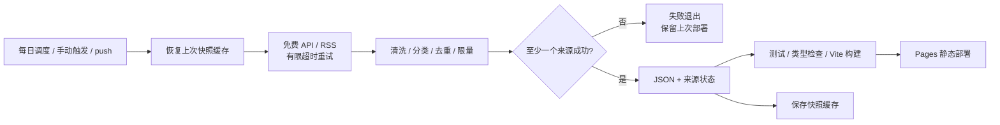

# AI News 技术方案与选型

## 1. 修订与需求自检
v1.0 / 2026-10-03；对应 01-requirements-analysis.md。
背景、范围、模块、数据结构、接口、流程、风险、任务已明确；无现有代码可复用。
无 Java/SQL/数据库，采用标准模板的静态产品裁剪版。

## 2. 技术选型
| 层 | 选择 | 取舍 |
|---|---|---|
| UI | TypeScript + 原生 DOM + CSS | 交互量有限，不引入 React/状态管理；更小运行时 |
| 构建 | Vite | 类型检查独立运行；相对 base 支持 Pages 项目路径 |
| 采集 | Node.js 24 + 原生 fetch | 与前端工具链共享运行时，无额外后端 |
| RSS | fast-xml-parser | 正规 XML 解析；禁用危险实体与 DTD |
| 数据 | 版本化 JSON | 可审计、可缓存、无需数据库 |
| 自动化 | GitHub Actions → GitHub Pages | 按北京时间每日 08:23 与 14:23 冗余尝试；避免整点 |
| 测试 | node:test + Playwright | 采集边界测试与浏览器实际交互验收 |

## 3. 总体流程

## 4. 数据模型与接口
无数据库；public/data/feed.json 为浏览器唯一数据接口。
- schemaVersion：固定 1；generatedAt：本轮实际生成时间。
- sources[]：id/name/homepage/status/lastSuccessAt/itemCount/error。
- items[]：id/title/summary/url/sourceId/sourceName/categories/tags。
- 时间：publishedAt 可空、updatedAt 可空、collectedAt 必填。
- 指标：metricLabel/metricValue 可空；rankScore 仅来源内排名归一化。
- 浏览器校验结构后渲染，外部文本统一转义；只接受 HTTPS 原文链接。
- localStorage：仅主题与收藏 ID；读取异常或损坏时回退默认。
- 核心实体关系：一个 Source 对多个 Item；Item 可有多个 Category。

## 5. 数据源与策略
| 源 ID | 接口 | 内容 |
|---|---|---|
| github-projects | GitHub search/repositories | 最近 30 天活跃、AI topic、stars 排序 |
| github-skills | GitHub search/repositories | agent-skills topic；独立 Skills 分类 |
| github-apps | GitHub search/repositories | gradio topic 的可体验项目；HF 不可达时仍有独立来源 |
| hf-models | Hugging Face /api/models | trendingScore 排序，保留原始创建/更新时间 |
| hf-spaces | Hugging Face /api/spaces | trendingScore 排序，应用案例 |
| hf-blog | Hugging Face /blog/feed.xml | 新闻、模型动态、教程 |
| github-blog | GitHub /ai-and-ml/feed/ | 开发实践与使用技巧 |
- 本机已验证 GitHub API/RSS 可达；HF 本机直连超时，必须保留失败状态，后续在 runner 验证。
- 本机环境失败不视为免费源不可用，也不能写成已经验证成功。
- 每个 API 最多 30 条；单 RSS 最多 30 条；总快照最多 500 条。
- 文章按 30 天窗口保留；项目类成功时替换本源快照，失败沿用旧快照。
- 重复 URL 合并分类，去除常见跟踪参数；标题不同但 URL 相同不重复。
- 单请求 15 秒，最多 3 次尝试，指数退避；尊重 Retry-After，上限超出则本轮失败。
- 限制响应体大小 2MB；不跟随外部链接抓正文、不执行 feed HTML。
- RSS 禁止 DOCTYPE/ENTITY；无效结构或零条有效内容视为源失败。

## 6. 页面与视觉
- 编辑部式版面：白/浅灰底、墨黑文本、草绿点缀；深色采用炭黑和浅绿。
- 圆角信息卡、定制 SVG 轨道图形、无远程字体/远程图片依赖。
- 搜索与筛选即时组合；无结果时可一键重置；收藏不影响主榜排序。
- 最新排序使用原始发布时间/更新时间；热门排序说明只是跨源发现参考。
- UI 展示北京时间、采集降级警告、来源明细；禁止伪装“刚刚发布”。
- 主题与动效通过 CSS 变量/prefers-reduced-motion 实现。

## 7. 安全、性能与部署
- 外部文本不作为 HTML；链接 HTTPS 白名单协议，rel=noopener noreferrer。
- 不将 GITHUB_TOKEN 注入前端；工作流 contents:read，部署仅 pages:write/id-token:write。
- 工作流不得 commit/push 数据；使用 Actions cache 跨日恢复，缓存丢失时回退仓库种子快照。
- 全源失败在写文件前退出；构建失败不发布；原子写入数据。
- CI 对 PR 只做离线测试与构建，不部署、不采集。
- 两次日调度减少单次延迟风险，不能解决平台长期停用；README 明确维护方式。
- 浏览器不直接访问第三方 API，因此无 CORS 与客户端 token 暴露问题。
- 静态缓存单次不超过 500 条，前端每次 12 条；JS/CSS gzip 目标低于 100KB。
- 回滚：管理员重新运行已知正常提交的部署，必要时用快照模式，不进行自动 Git 写入。

## 8. 实施拆解（AI 执行，非工期承诺）
| 任务 | 输出 | 顺序 |
|---|---|---|
| 需求/方案/自评 | 01/03/04 文档 | 1 |
| 采集与标准化 | scripts + 真实 JSON | 2 |
| 交互与视觉 | src + SVG/CSS | 3 |
| 自动化与部署 | workflows + README | 4 |
| 审查与验收 | 测试、截图、验收日志 | 5 |
人负责首次仓库发布与 Pages 权限开启；AI 不代替用户 commit/push。

## 9. 已核实的官方依据
- https://docs.github.com/en/pages/getting-started-with-github-pages/what-is-github-pages
- https://docs.github.com/en/actions/reference/workflows-and-actions/events-that-trigger-workflows#schedule
- https://docs.github.com/en/rest/search/search#search-repositories
- https://huggingface.co/docs/hub/api
- 2026-10-03 读取 GitHub 官方文档确认 Pages 为静态托管，调度可能延迟/丢弃及 60 天无活动停用限制。

> 故障保留例外：失败来源沿用上次成功快照，文章可能超过 30 天；保留原始日期并标记来源失败，不伪装成新内容。
